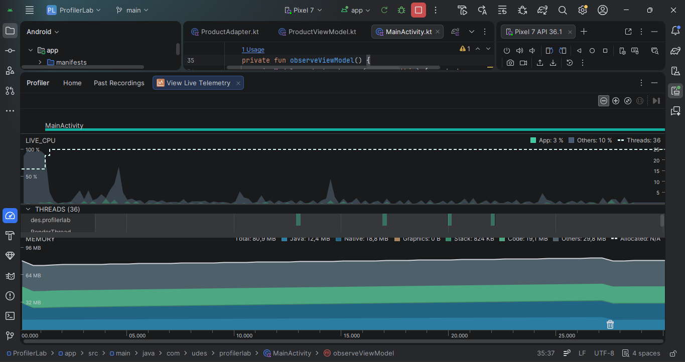
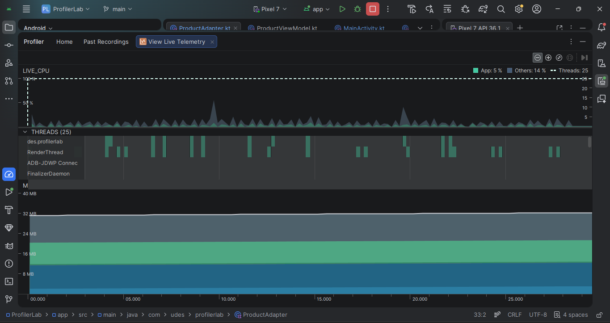
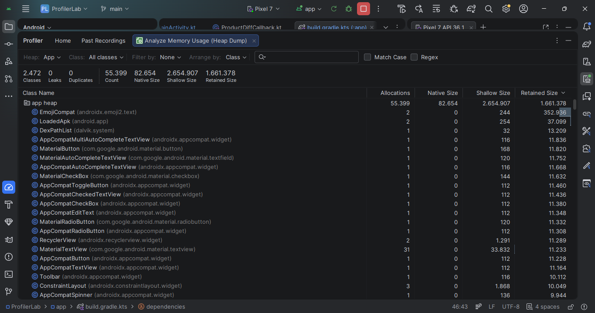

# ProfilerLab — Carreño Post1 U8

Aplicación Android desarrollada para la **Unidad 8: Rendimiento, Optimización y Experiencia Fluida** de la asignatura Aplicaciones Móviles — Ingeniería de Sistemas, Universidad de Santander (UDES) 2026.

## Descripción

La app simula un inventario de 500 productos con actualizaciones de stock cada 500ms, permitiendo evidenciar problemas de rendimiento con `notifyDataSetChanged()` y demostrar la mejora obtenida al implementar `DiffUtil` con `ListAdapter`, optimización de memoria con `ViewBinding` y limpieza de recursos en `onDestroyView()`.

---

## Requisitos

- Android Studio Hedgehog (2023.1.1) o superior
- JDK 17 o superior
- Android 8.0+ (API 26+)
- Emulador o dispositivo físico con API 29+ recomendado

---

## Configuración y ejecución

1. Clona el repositorio:
```bash
git clone https://github.com/Johan09CD/Carre-o-post1-u8-Apps
```

2. Abre el proyecto en Android Studio

3. Espera que Gradle sincronice las dependencias

4. Ejecuta la app en un emulador o dispositivo físico

---

## Tecnologías utilizadas

| Tecnología | Uso |
|---|---|
| RecyclerView | Lista de alto rendimiento para 500 items |
| ListAdapter + DiffUtil | Actualización eficiente de items cambiados |
| ViewBinding | Acceso seguro a vistas sin findViewById |
| LiveData | Observación reactiva de datos del ViewModel |
| ViewModel + Coroutines | Lógica de negocio y actualizaciones periódicas |
| Android Profiler | Medición de CPU y memoria |
| Trace.beginSection() | Trazas personalizadas para medir rendimiento |

---

## Arquitectura

```
com.udes.profilerlab
├── ProductItem.kt          # Modelo de datos
├── ProductDiffCallback.kt  # DiffUtil para comparar items
├── ProductAdapter.kt       # ListAdapter optimizado
├── ProductViewModel.kt     # ViewModel con actualizaciones cada 500ms
├── ProductFragment.kt      # Fragment con limpieza de ViewBinding
└── MainActivity.kt         # Activity contenedora del Fragment
```

---

## Optimizaciones implementadas

### 1. DiffUtil con ListAdapter
Se reemplazó `notifyDataSetChanged()` por `ListAdapter` con `DiffUtil.ItemCallback`. Esto permite que el adaptador calcule diferencias entre listas en un background thread y redibuje **solo los items que realmente cambiaron**, en lugar de toda la lista.

**Antes:** cada actualización de stock redibujaba los 500 items completos.  
**Después:** solo el item cuyo stock cambió recibe una actualización visual.

### 2. setHasFixedSize(true)
Se agregó `setHasFixedSize(true)` al RecyclerView para indicar que su tamaño no cambia cuando se actualiza el contenido, evitando mediciones innecesarias del layout en cada actualización.

### 3. Limpieza de ViewBinding en onDestroyView()
Se implementó el patrón estándar de limpieza de ViewBinding en el Fragment para evitar memory leaks:
```kotlin
override fun onDestroyView() {
    super.onDestroyView()
    binding.recyclerView.adapter = null
    _binding = null
}
```

### 4. Trazas personalizadas con Trace.beginSection()
Se agregaron trazas personalizadas alrededor de `submitList()` para medir el tiempo exacto de actualización en el System Trace del Profiler.

---

## Análisis de métricas

### CPU — Antes de DiffUtil
- Picos de CPU cercanos al **100%** al cargar los 500 items
- `Skipped 158 frames` detectado en Logcat
- Frames tardando hasta **3566ms** (Davey frames)
- `notifyDataSetChanged()` forzaba el redibujado completo de la lista

### CPU — Después de DiffUtil
- CPU App estable en **3-5%** durante actualizaciones
- Solo el primer item muestra animación de cambio
- Los 499 items restantes no se redibujan
- Eliminación total de Davey frames durante actualizaciones normales

### Memoria — Memory Profiler
- **0 Leaks** detectados después de implementar limpieza de ViewBinding
- **0 Duplicates** en el heap
- No se detectaron instancias retenidas de `ProductFragment` después del GC
- Heap estable sin crecimiento sostenido

---

## Capturas de pantalla

### CPU Profiler — Antes de DiffUtil (baseline)



### CPU Profiler — Después de DiffUtil (optimizado)



### Memory Profiler — Heap sin retained instances



---